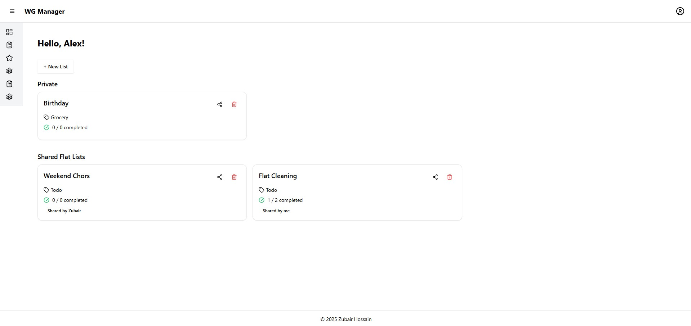

# WG Manager – Collaborative Todo & Grocery Lists for Flatmates

| <!-- -->           | <!-- -->                                              |
| ------------------ | ----------------------------------------------------- |
| **Author**         | Zubair Hossain                                        |
| **Purpose**        | Learning Supabase, backend a sa service               |
| **Version**        | 1.0.0                                                 |
| **Git Repository** | [Github](https://github.com/zubair001/wg-manager.git) |

## Objective

WG Manager is a shared list application designed for flatshares (WGs). It helps roommates collaborate on daily tasks by organizing todo and grocery lists with different visibility levels — private, flat-shared, and publicly shared.
The app focuses on usability, clean architecture, and practical features that make it easy for users to manage shared responsibilities in a flat.

---

## Tech Stack

- **Frontend**: Vite + React + TypeScript + TailwindCSS
- **Backend**: Supabase (PostgreSQL + Auth + RLS)
- **State Management**: Zustand + Context API
- **Styling**: ShadCN UI + Lucide icons
- **Validation**: Zod
- **Routing**: React Router

---

## Features

### Authentication

- Signup flow includes full name input
- Login/logout using Supabase auth
- Auth state managed globally using AuthProvider and useAuth
- New users are added to a default flat and hydrated on login/signup

### Flat & User Management

- For simplicity, Users automatically added to a default flat
- new members can signup using `Email Signup`
- Flat-aware list sharing via `flat_id`
- Custom policy-based access (via Supabase RLS)

### Lists Management

- Create todo or grocery lists
- Edit, archive, or delete lists
- Mark lists as templates for reuse
- Real-time completion status (e.g., "5 / 7 completed")
- List visibility: private (only me), flat (shared with flatmates), shared (public)

### List Sharing System

- Secure public sharing via shared_links table
- Read-only list view via unique token at /share/:token
- Share modal with toggle and clipboard copy
- Prepared for link expiration and editable permissions

### Dashboard & UX

- Categorized dashboard: Private, Shared Flar, Public
- Author displayed as “me” or the real name of the owner
- Clean and minimal UI for managing and navigating lists
- Custom dropdown for avatar actions with profile/logout

---

### Backend Highlights

- Authentication handled through secure excripted auth system.
- Full SQL migration scripts for all tables
- RLS policies enforced for data privacy

---

## Testing

The testing section will include:

- Unit tests for core services
- UI tests for protected routes and form validation

---

## Structure

```
src/
├── components/         // UI components (ListCard, Modal, etc.)
├── context/            // AuthProvider
├── hooks/              // useAuth, usePublicShare, etc.
├── interfaces/         // type definitions
├── lib/                // supabaseClient, logger, constants, utils
├── pages/              // All Pages e.g. Dashboard, SharedList, etc.
├── routes/             // Routes -> App Router, Private Routes
├── schemas/            // Zod validation
├── services/           // Supabase service logic (lists, sharedLinks, archive etc.)
├── store/              // Zustand stores
```

---

## Done Highlights

- ✅ Auth + Hydration + Reuse
- ✅ Dashboard filters + Categorization
- ✅ List creation with full schema support
- ✅ Add as Template and reuse it
- ✅ Public sharing via `shared_links` system
- ✅ Protected routes + clean UI
- ✅ Modular architecture

## How to Run

```bash
git clone [repo-url]
cd wg-manager
npm install
npm run dev
```

Make sure to set your `.env` for Supabase URL and anon key.

## License

Contributor: [Zubair Hossain](https://de.linkedin.com/in/zubair-hossain-b70710a1)

## Screenshots

### Login Page


### User Dashboard



### Dashboard Page Side Navigation


### List Card


### List Details Page


### Templates


### Shared (Public) List View


### Made with ♥️ by Zubair Hossain

MIT © Zubair Hossain.
